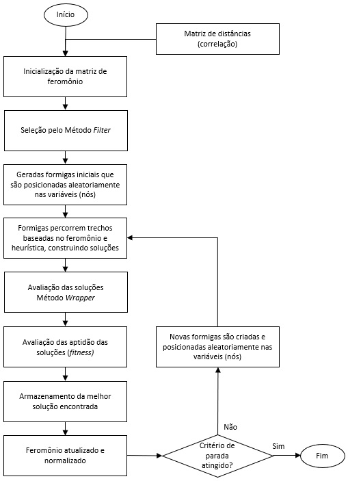

# Master_Thesis_Improved_ACO_for_selecting_features
 Trabalho de pesquisa relacionado à dissertação de Mestrado do PROFICAM realizado no ITV/UFOP

## ALGORITMO ACO RANK BASED APRIMORADO PARA USO NA SELEÇÃO DE VARIÁVEIS EM MODELOS DE CLASSIFICAÇÃO

Repositório referente à pesquisa entitulada acima. Programa: Mestrado Profissional em Instrumentação, Controle e Automação de Processos de Mineração - PROFICAM. Instituições: UFOP / Instituto Tecnológico VALE - ITV.

## Introdução:

Os algoritmos de aprendizado de máquina (machine learning) são bastante eficientes em descobrir padrões em grandes volumes de dados mas, contraditoriamente, também são bastante afetados por tendências ou propensões desvirtuadas ou preconceituosas, mais conhecidas como vieses. Seleção de atributos é um processo pelo qual se busca, de forma automatizada, o melhor subconjunto de atributos em um determinado conjunto de dados.

■ Keywords: colônia de formigas, meta-heurística, aprendizado de máquina, seleção de atributos, redução de dimensionalidade

## Principais trabalhos de referência utilizados na pesquisa:

**WFACOFS - Wrapper Filter based Ant Colony Optmization for Feature Selection.** - A wrapper-filter feature selection technique based on ant colony optimization. Arquivo .pdf disponível na pasta de Artigos. Link: [https://link.springer.com/article/10.1007/s00521-019-04171-3].

**ACO Rank-based - A New Rank Based Version of the Ant System - A Computational Study.** - Arquivo .pdf disponível na pasta de Artigos.

**Phik - A new correlation coefficient between categorical, ordinal and interval variables with Pearson characteristics** - Arquivo .pdf disponível na pasta de Artigos. Link: [https://www.sciencedirect.com/science/article/pii/S0167947320301341].

**Seleção de atributos baseado no algoritmo de otimização por colonia de formigas para processos mineradores** - Arquivo .pdf disponível na pasta de Artigos. Link: [https://repositorio.ufop.br/handle/123456789/14471].

## Proposta:

O projeto de pesquisa tem como objetivo geral aprimorar a meta heurística Rank-based Ant System e avaliar sua performance para seleção de variáveis comparando com algoritmo WFACOFS, de performance reconhecida dentre modelos que utilizam ACO. Foi adotado como estrutura de código o algoritmo AS Rank-based e a partir dele realizadas implementações e ajustes de forma que o algoritmo estivesse apto para executar seleção de variáveis e utilizasse os métodos do tipo Filter e Wrapper. O algoritmo foi desenvolvido adotando-se a linguagem Python 3.8.3 com o auxílio de ferramentas disponibilizadas pelas bibliotecas relacionadas à Preparação de Dados, Estatísticas e Machine Learning. Assim como é feito no WFACOFS, a acurácia é adotada como métrica de avaliação ficando a seleção final das melhores soluções a cargo de uma função específica, chamada de função de aptidão.

- Fluxograma do algoritmo:

## Bases de dados estudadas:

Para a avaliação do desempenho do algoritmo proposto (ACOFSrank)  em rela;áo ao WFACOFS, foram selecionadas as mesmas bases de dados utilizadas no WFACOFS e que ainda encontravam-se
disponíveis. Estas bases são disponibilizadas através do repositório UCI e frequentemente citadas na literatura para avaliação de modelos de aprendizado de máquina.

- Breast Cancer
- Wine
- Ionosphere
- Soybean Small
- Hill Valley (without noise training)
- Arrythmia
- Madelon (training base)

